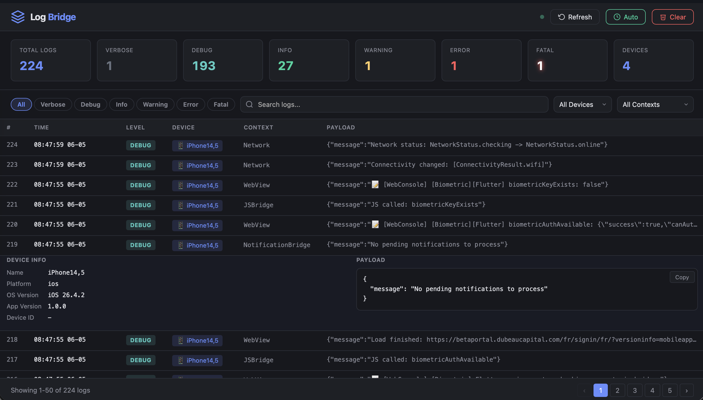

# 🌉 Log Bridge

A **100% local, privacy-first** log server for mobile apps — built with Express.js and TypeScript. Runs entirely on your machine over your WiFi network. **No cloud, no third-party services, no data leaves your LAN.**

All log data stays between your device and your computer. Period.

---

## 🔒 Privacy & Security

> **Log Bridge runs exclusively on your local network (WiFi/LAN).** Your app and this server must be on the same network. No data is ever sent to the cloud or any third-party service. Everything stays private, on your machine.

- 🏠 **Local-only** — Server runs on your computer, devices connect via local WiFi
- 🔐 **No cloud** — Zero external services, no sign-up, no API keys
- 🚫 **No telemetry** — No analytics, no tracking, no data collection
- 💻 **Your machine** — All logs are stored locally in files on your disk

---

## ✨ Features

- **REST API** — Receive logs from any mobile app via `POST /api/logs`
- **Web Dashboard** — Beautiful dark-themed UI to view, search, and filter logs in real-time
- **Multi-Device** — View logs from multiple devices simultaneously
- **Pretty Terminal Output** — Color-coded log levels with `chalk`
- **File Persistence** — Logs saved in NDJSON format (`logs/app.log`)
- **Auto-Discovery** — mDNS/Bonjour advertisement so apps find the server automatically
- **CORS Enabled** — Accepts connections from any device on the same LAN
- **Graceful Shutdown** — Clean teardown of mDNS and HTTP server on SIGINT/SIGTERM
- **Hot-Reload** — Development with `tsx watch`

---

## 📸 Dashboard



---

## 🚀 Quick Start

```bash
# Install dependencies
npm install

# Start development server (hot-reload)
npm run dev

# Production build
npm run build

# Start production server
npm start
```

The server starts on `http://0.0.0.0:3000` by default.

---

## 📡 API Endpoints

### `POST /api/logs`

Receive a log entry from a Flutter client.

**Request Body:**

```json
{
  "device_info": {
    "deviceName": "Pixel 7",
    "osVersion": "Android 14",
    "appVersion": "1.2.0",
    "platform": "android",
    "deviceId": "abc123"
  },
  "level": "info",
  "timestamp": "2025-05-05T14:30:00.000Z",
  "context": "AuthService",
  "payload": { "message": "User logged in", "userId": 42 }
}
```

| Field         | Type     | Required | Description                  |
|---------------|----------|----------|------------------------------|
| `device_info` | object   | ✅       | Device metadata              |
| `level`       | string   | ✅       | Log level                    |
| `timestamp`   | string   | ✅       | ISO 8601 timestamp           |
| `context`     | string   | ❌       | Source context/module name    |
| `payload`     | any      | ❌       | Arbitrary log data           |

**Response:** `200 OK`

```json
{ "success": true, "message": "Log received successfully." }
```

### `GET /api/health`

Health check endpoint.

**Response:** `200 OK`

```json
{
  "success": true,
  "message": "Server is running.",
  "data": { "status": "ok", "uptime": 123.45 }
}
```

---

## 🎨 Log Levels

| Level     | Color             |
|-----------|-------------------|
| `verbose` | ⬜ Gray           |
| `debug`   | 🟦 Cyan          |
| `info`    | 🟩 Green         |
| `warning` | 🟨 Yellow        |
| `error`   | 🟥 Red           |
| `fatal`   | ⬜🔴 Bold White on Red |

---

## 📂 Project Structure

```
log-bridge/
├── src/
│   ├── server.ts                  # Entry point — HTTP server + mDNS
│   ├── app.ts                     # Express app factory
│   ├── config/index.ts            # Configuration (port, CORS, mDNS)
│   ├── types/log.ts               # TypeScript interfaces
│   ├── routes/logRoutes.ts        # Route definitions
│   ├── controllers/logController.ts  # Request handlers
│   ├── services/
│   │   ├── logger.ts              # Terminal pretty-print
│   │   ├── fileLogService.ts      # File persistence (NDJSON)
│   │   └── discoveryService.ts    # mDNS/Bonjour advertisement
│   └── middlewares/errorHandler.ts # Global error handler
├── logs/                          # Runtime log output (gitignored)
├── package.json
├── tsconfig.json
└── AGENTS.md
```

---

## 📡 mDNS Auto-Discovery

The server advertises itself as `_http._tcp` named `FlutterLogServer` on the local network. Mobile apps on the **same WiFi network** can discover it automatically:

- **Flutter** — [`nsd_flutter`](https://pub.dev/packages/nsd_flutter) or [`bonsoir`](https://pub.dev/packages/bonsoir)
- **React Native** — [`react-native-zeroconf`](https://github.com/Apercu/react-native-zeroconf)
- **iOS (native)** — [`NetService`](https://developer.apple.com/documentation/foundation/netservice)
- **Android (native)** — [`NsdManager`](https://developer.android.com/development/connectivity/network-service-discovery)

> ⚠️ Both the server and mobile device must be connected to the **same WiFi network** for discovery and logging to work.

---

## ⚙️ Configuration

| Environment Variable | Default     | Description          |
|----------------------|-------------|----------------------|
| `PORT`               | `3000`      | Server port          |
| `HOST`               | `0.0.0.0`   | Bind address         |

---

## 📄 License

[MIT](LICENSE)